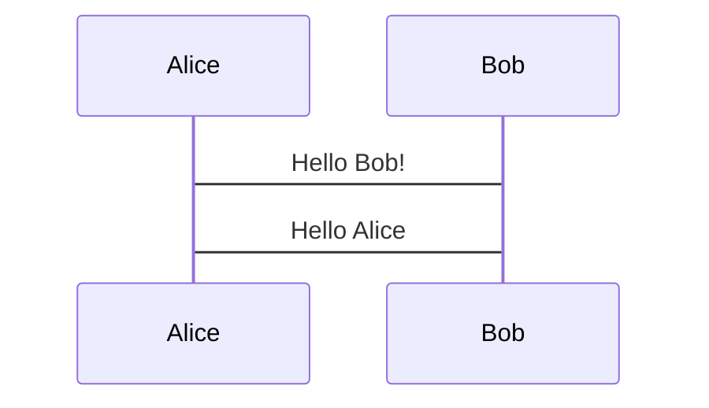

# miew
miew is markdown previewer.

## Features

miew has several great features.
- selectable paser, renderer, draweer
- every module is avilability reused
- support mermaid-syntax

- support katex-syntax
$$
f(x) = 1 + x / ( 1 + x)
$$

## miew architecture
see following url
[miew Architecture](https://github.com/takeshiD/miew/miew_architecture.svg)
